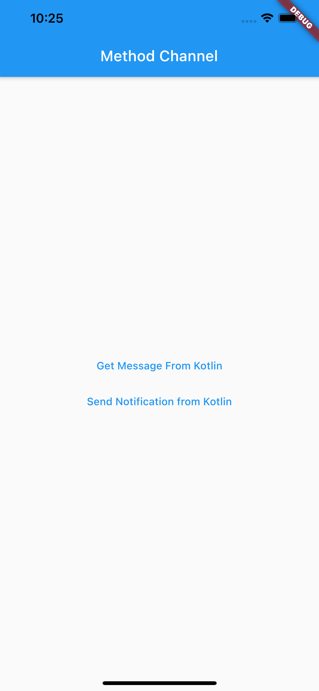

# Method Channel Test

A Flutter Project implementing push notifications using native integration through Method Channel.

## How to run

First of all you should install Flutter, check the
[online documentation](https://flutter.dev/docs)  for more information.

## How MethodChannel works
Here is a [MethodChannel Article](https://medium.com/47billion/creating-a-bridge-in-flutter-between-dart-and-native-code-in-java-or-objectivec-5f80fd0cd713).

## Images

